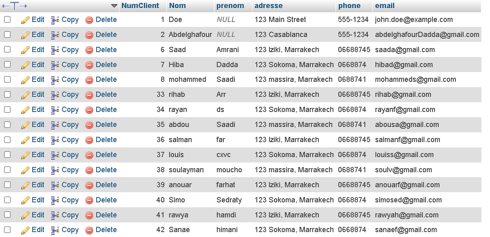
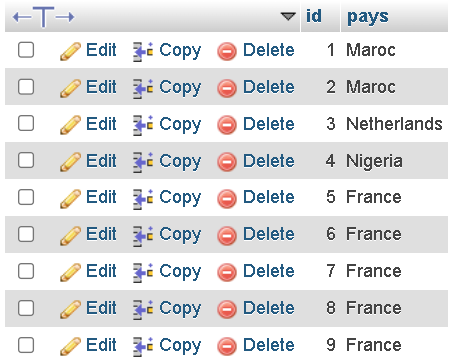
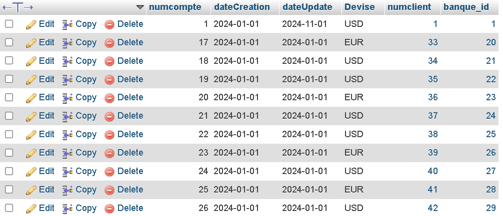
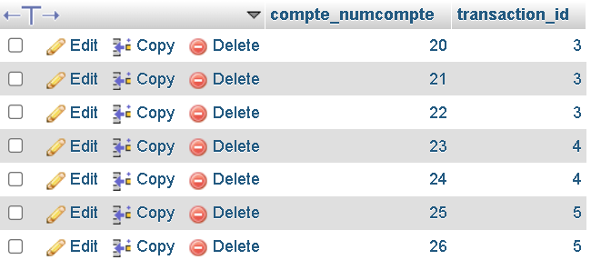
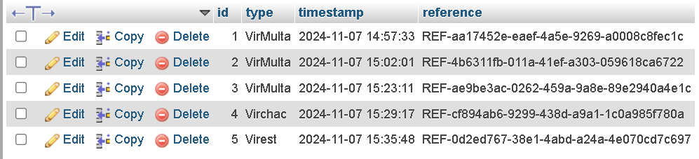

# vous trouverez monsieur un petit vidéo de démonstration avec les fichiers en dessus 

# Screens des tables de base de données :

# table client : 

# table banque : 

# table compte : 

# table compte_transactions :

# table transactions : 

